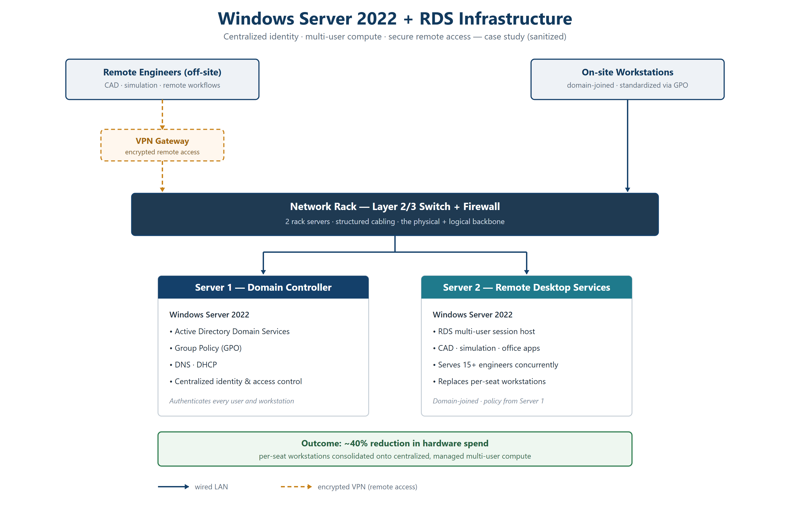

# Windows Server 2022 + RDS Infrastructure — Case Study

A documented case study of a production IT environment I designed and built
from bare metal for a 15+ engineer aerospace startup: centralized identity,
multi-user compute, and secure remote access.

> This is an architecture & decisions writeup. No employer data, credentials,
> IPs, hostnames, or proprietary configuration is included. Shared with
> permission, sanitized.

## The problem
A growing engineering team on per-seat workstations: rising hardware cost,
inconsistent environments, no central identity, ad-hoc remote access.

## What I built
- **Bare-metal Windows Server 2022** — provisioned from scratch
- **Active Directory + Group Policy** — centralized identity, access control,
  and standardized machine policy
- **Remote Desktop Services (RDS)** — multi-user environment replacing
  per-seat workstations for CAD/simulation/office workloads
- **Network rack, 2 servers, Layer 2/3** — the physical + logical backbone
- **VPN remote access** — secure connectivity for distributed engineers

## Outcome
- **~40% reduction in hardware spend** by consolidating workstations onto
  centralized multi-user compute
- Central identity + policy → consistent, manageable, more secure environment
- Repeatable OS imaging and onboarding

## Architecture (sanitized)

## What I learned
- Designing AD/GPO structure for a small but growing org
- RDS sizing, licensing, and session management trade-offs
- Balancing cost, security, and usability in a real budget
- Owning infrastructure end-to-end: procurement → build → run → support

## Skills demonstrated
Windows Server · Active Directory · Group Policy · RDS · VPN ·
network infrastructure · IT procurement · systems administration
